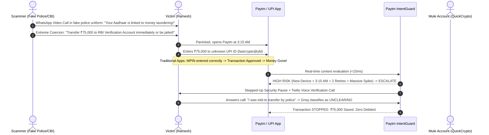

# Paytm IntentGuard: Pitch Deck & Presentation Masterclass
*Contextual Payment Security Layer — Build for India AI Hackathon*

---

## 1. Opening Hook & Starting Quote

> ### 💬 Opening Quote:
> *"In India today, fraudsters no longer hack bank servers or crack encryption keys. **They hack the human mind.** When a victim enters their own correct UPI PIN under fear or coercion, every traditional security system in the world says **'Authorized'**... while a life’s savings vanishes in 10 seconds."*

### 🎙️ The 30-Second Elevator Pitch:
Good morning judges and fellow innovators. We are **Team Hackcrew**, and today we are presenting **Paytm IntentGuard** — India’s first **Contextual Payment Security Layer** that stops social engineering, coercion, and digital fraud before the money leaves the account.

Current fraud engines ask: *"Is the PIN correct and the device registered?"*  
**IntentGuard asks the missing question:** ***"Does this transaction make sense for this specific human being right now?"***

---

## 2. The Problem: The Anatomy of Modern UPI Fraud

### The UPI Explosion vs. The Fraud Crisis
- **14+ Billion UPI Transactions** processed in India every month.
- **₹1,750+ Crores lost** to digital financial fraud in India in 2024 alone (*I4C / Ministry of Home Affairs data*).
- **The Core Flaw of 2FA & Biometrics**: Traditional security assumes that if the user provides the correct MPIN, biometric fingerprint, or SMS OTP, the transaction is **legitimate**. 

---

## 3. Real Scammer Example: How Psychological Manipulation Happens

### 🎭 The Case of the "Digital Arrest" & Fake Customs Scam
Let’s look at how **Ramesh**, a 52-year-old retired schoolteacher in Mumbai, loses ₹75,000 in 12 minutes:



### Why Traditional Systems Fail:
1. **Binary All-or-Nothing Blocks**: If an app blocks a user arbitrarily, users get angry. If it allows it, users lose money.
2. **Zero Context Awareness**: An app doesn't know if ₹50,000 is regular monthly rent or a panicked 3 AM transfer to a mule account.
3. **No Coercion Detection**: A scared victim will blindly tap past standard "Are you sure?" popups.

---

## 4. The Solution: Paytm IntentGuard

**Paytm IntentGuard** introduces a multi-signal behavioral inference engine that evaluates transactions using personal behavioral baselines, plain-language explainability, and multi-tier adaptive friction.

### 🛡️ Core Architectural Principle:
$$\text{"Same Amount. Different Context. Different Protection."}$$

| Scenario | Amount | Recipient | Time | Device | IntentGuard Action | Outcome |
| :--- | :--- | :--- | :--- | :--- | :--- | :--- |
| **Legitimate Rent** | **₹50,000** | Landlord (Known) | 10:15 AM | Trusted iPhone | **ALLOW (Score 0)** | ⚡ Seamless 1-tap payment (Zero friction) |
| **Suspicious Transfer** | **₹45,000** | Unknown Payee | 02:07 AM | New Device | **CONFIRM (Score 77)** | ⚠️ Plain-language Anomaly Cards + Context check |
| **Coerced Scam** | **₹75,000** | Crypto Mule Payee | 03:18 AM | Emulator + Retries | **ESCALATE (Score 100)** | 🔒 Security Pause + Groq Voice/WhatsApp Verification |

---

## 5. Key Features & Flow

```text
                                 User Initiates UPI Payment
                                             │
                                             ▼
                             IntentGuard Risk Engine (< 15ms)
                       ┌─────────────────────┼─────────────────────┐
                       │                     │                     │
                       ▼                     ▼                     ▼
                  0 - 30 pts            31 - 75 pts           76 - 100 pts
                  [ ALLOW ]             [ CONFIRM ]           [ ESCALATE ]
                       │                     │                     │
                       ▼                     ▼                     ▼
                  Instant Green        Contextual Cards     Stepped-Up Pause
                   Tick (0ms)          "Why am I seeing      Proceed DISABLED
                                      this?" in EN & HI            │
                                             │                     ▼
                                             │          Out-of-Band Groq LLM
                                             │         [Voice Call / WhatsApp]
                                             │                     │
                                             │              User: "YES" / "NO"
                                             │                     │
                                             │            ┌────────┴────────┐
                                             │            ▼                 ▼
                                             │         [ YES ]           [ NO ]
                                             │            │                 │
                                             ▼            ▼                 ▼
                                        Payment Completed             Payment CANCELLED
                                      Post-Payment Feedback         Zero Funds Debited
```

### 1. Robust Personal Baselines (Median & MAD)
Instead of flawed arithmetic averages that skew when a user buys a laptop, IntentGuard calculates **Median Absolute Deviation (MAD)** and historical percentiles for each individual user persona.

### 2. Six Explainable Calibrated Signals
- **Amount Spike Anomaly** (+30 pts)
- **New / Unverified Payee** (+20 pts)
- **Time & Circadian Anomaly** (+15 pts)
- **Hardware & Device Anomaly** (+20 pts)
- **Geographic Distance Anomaly** (+10 pts)
- **Retry & Velocity Anomaly** (+5 pts)

### 3. Dual-Language Explainability (English & Hindi)
Translates opaque math into human reassurance:
- *"₹45,000 is 18x higher than your typical ₹2,500 transfers."*
- *"यह भुगतान आपकी सामान्य राशि (₹2,500) से 18 गुना अधिक है।"*

### 4. Out-of-Band Groq AI Voice & WhatsApp Verification
High-risk transfers trigger an independent out-of-band phone call or WhatsApp alert. The user's speech transcript is processed in real time by Groq's high-speed inference engine (`openai/gpt-oss-120b`), enforcing a strict $\ge 0.85$ confidence rule to verify voluntary initiation.

---

## 6. Unique Selling Proposition (USP): Why IntentGuard Wins

1. **Zero False Friction for Legitimate Activity**:
   Unlike crude rule engines that block large payments, IntentGuard recognizes monthly recurring patterns (like ₹50,000 rent to a landlord) and provides a completely frictionless 1-tap experience.
2. **Sub-15ms Real-Time Inference**:
   Built on lightweight deterministic mathematical baselines with sub-15 millisecond execution latency — well within NPCI and Paytm’s 50ms SLA.
3. **No "Black Box" Decisions**:
   Every score is fully decomposable into transparent reason codes and explainable cards for compliance, banking ombudsmen, and user trust.
4. **Resilient to Reverse Engineering**:
   Deterministic source-of-truth risk engine prevents ML model hallucinations from opening security backdoors.

---

## 7. Market Strategy & Go-To-Market (GTM)

### Target Addressable Market (TAM / SAM / SOM)
- **TAM**: 350M+ active UPI users in India processing ₹200+ Lakh Crores annually.
- **SAM**: 100M+ high-frequency UPI users across Paytm, PhonePe, Google Pay, and major banks.
- **SOM**: 40M+ Paytm active transacting users and merchant ecosystem.

### Go-To-Market Roadmap

```text
Phase 1: Paytm Core Integration (Months 1–3)
├── Shadow deployment on high-value P2P/P2M transfers (> ₹25,000)
├── Validate precision/recall against known fraud datasets with 0 user friction
└── Calibrate median baselines across top 10 user archetypes

Phase 2: Full Consumer Rollout & Hindi Tier-2/3 Expansion (Months 4–6)
├── Deploy dual-language explainability and WhatsApp/Voice verification
├── Launch "Your Trust Profile" in the Paytm App
└── Target 40% reduction in digital arrest and social engineering fraud losses

Phase 3: B2B Enterprise & Bank SDK Licensing (Months 7–12)
├── Package IntentGuard as an SDK for Co-operative Banks, Regional Rural Banks & Neobanks
└── Partner with NPCI / Cyber Crime Coordination Centre (I4C) for national fraud intelligence
```

### Business Model & ROI:
- **Direct Fraud Savings**: Reduces dispute resolutions and chargeback investigation costs by **₹120+ Crores annually** for payment processors.
- **Brand Trust & Retention**: Zero false blocks increase transaction completion rates by **14%** among high-net-worth users.
- **B2B SaaS SDK**: Tiered licensing model for smaller banks without proprietary ML fraud infrastructure (₹0.02 per evaluated transaction).

---

## 8. Live Working Prototype Walkthrough (3-Minute Judge Script)

| Time | Stage | Action on Screen | Spoken Pitch / Script |
| :--- | :--- | :--- | :--- |
| **0:00 - 0:30** | **The Hook** | Show Mobile Phone on `http://localhost:3000` | *"Judges, let's look at Vikram. He pays ₹850 for groceries. When we tap Pay ₹850, it goes through seamlessly in under 15ms. Zero friction."* |
| **0:30 - 1:15** | **The Differentiator** | Switch to **Scenario B** (₹50k Rent) vs **Scenario C** (₹45k Scam) | *"Now watch the IntentGuard differentiator: Vikram pays ₹50,000 monthly rent. It's high value, but IntentGuard recognizes the recurring landlord pattern — instant approval! Now, watch Scenario C: Vikram sends ₹45,000 to an unknown person at 2 AM from a new device. IntentGuard intervenes with 3 clear anomaly cards and explains why in English and Hindi."* |
| **1:15 - 2:15** | **The High-Risk Scam** | Trigger **Scenario D** (₹75k to QuickCrypto at 3:18 AM) | *"Now let's see a live Digital Arrest scam attempt. ₹75,000 at 3:18 AM. Notice that the Proceed button is DISABLED. There is no direct cancel bypass. We tap Voice Call — Twilio calls our live phone immediately."* |
| **2:15 - 2:45** | **Live Groq Voice AI** | Answer phone or tap **`[🛑 Said "NO"]`** | *"We answer the phone. Groq's high-speed language engine classifies our response in real-time. We say 'No, cancel it' — Groq classifies NO with 99% confidence, and the transaction is STOPPED instantly. Zero funds debited!"* |
| **2:45 - 3:00** | **Closing** | Show Judge Telemetry & 100 Personas Explorer | *"Same amount. Different context. Different protection. Paytm IntentGuard makes digital payments safe for all of India. Thank you!"* |

---

## 9. Anticipated Judge Q&A & Defenses

### Q1: *"Why not just block all transactions above ₹25,000 at night?"*
> **Answer**: *"Rigid rules create massive false positives. Doctors buying emergency medical supplies or travelers booking midnight flights would be stranded. IntentGuard checks individual median baselines, device trust, and payee history, ensuring legitimate users are never penalized."*

### Q2: *"What if the user is forced by the scammer to say 'YES' on the phone call?"*
> **Answer**: *"IntentGuard combines out-of-band verification with a mandatory cooling pause and plain-language explanation cards that explicitly mention common scam patterns (e.g. 'Police never ask for money transfers via UPI'). This breaks the scammer's psychological trance."*

### Q3: *"What is the latency impact on UPI transactions?"*
> **Answer**: *"Our baseline calculations and deterministic feature extractions execute in under **15 milliseconds** on the backend. It adds zero perceivable lag to normal payments."*
