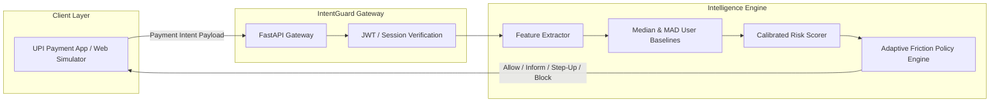

<div align="center">

# Paytm IntentGuard (`datadrishti`)

### Contextual Payment Security Layer & Behavioral Anomaly Detection

[](https://www.python.org/)
[](https://fastapi.tiangolo.com/)
[](Dockerfile)
[](backend/tests/)
[](LICENSE)

---

> **Core Thesis**: *"Same amount. Different context. Different protection."*  
> Standard payment security asks: *“Is this transaction technically authorized?”*  
> IntentGuard asks: *“Does this transaction make sense for this specific user in this context, or is it an indicator of coercion or panic fraud?”*

</div>

---

## 1. Problem & Contextual Innovation

Modern UPI transfers can be fully authorized with correct device tokens, biometric unlocks, and valid PINs while still representing malicious coercion (e.g. extortion, digital arrest scams, panic fraud).

Traditional binary fraud prevention mechanisms fail in two ways:
1. **False Positives**: Blocking legitimate large transfers (such as ₹50,000 monthly rent to a known landlord), frustrating users.
2. **Context Blindness**: Relying on opaque `"FRAUD DETECTED"` flags that provide zero explainability and fail to adjust friction dynamically.

### How IntentGuard Solves This:
- **Robust Statistical Baselines**: Replaces arithmetic means (skewed by outliers) with non-parametric **Median** and **Median Absolute Deviation (MAD)**.
- **6 Calibrated Risk Signals**: Evaluates behavioral deviation across amount, recipient, temporal, device, geographic, and velocity dimensions.
- **Adaptive Friction Policies**: Instead of binary Allow/Block choices, the system applies calibrated friction:

```
Risk Score  0 ──────────── 30 ───────────── 55 ───────────── 80 ──────────── 100
            │    ALLOW     │    INFORM     │    STEP-UP     │     BLOCK     │
            │  1-Tap Pay   │ Context Alert │ Biometric Reauth│ Transfer Hold │
```

---

## 2. Risk Scoring & Behavioral Model

The risk engine computes a composite score (0–100) based on 6 explainable factors:

| Factor | Weight | Evaluation Method | Rationale |
|---|---|---|---|
| **Amount Anomaly** | +30 | Z-score derived from personal Median & MAD | Identifies deviation from individual spending baselines. |
| **Recipient Novelty** | +20 | Historical counterparty frequency & age | First-time transfers to unknown accounts carry higher risk. |
| **Device Novelty** | +20 | Hardware fingerprint & IMEI hash validation | Protects against newly enrolled session hijacking. |
| **Time-of-Day Anomaly** | +15 | Circular temporal distance from active hours | Detects unusual 3:00 AM panic transfers. |
| **Geographic Anomaly** | +10 | Haversine distance from primary cluster | Flags rapid physical location shifts. |
| **Velocity Surge** | +5 | Sliding 15-minute transaction count | Guards against rapid account draining. |

---

## 3. System Architecture



---

## 4. Technology Stack

- **Backend**: Python 3.11, FastAPI, Pydantic v2, Uvicorn
- **Analytics & Math**: NumPy, Pandas, Scikit-learn (baseline clustering)
- **Frontend / Simulation**: Next.js, Tailwind CSS, Lucide Icons
- **Deployment**: Docker, Docker Compose, Vercel Serverless (`api/index.py`)
- **Testing**: Pytest (5 modular test suites)

---

## 5. Project Structure

```
datadrishti/
├── backend/
│   ├── app/
│   │   ├── api/                # Evaluation and simulation routes
│   │   ├── core/               # Configuration & policy thresholds
│   │   ├── services/           # Feature extraction & risk engine
│   │   └── schemas/            # Pydantic request/response models
│   ├── data/                   # Simulated transaction distributions
│   ├── tests/                  # Pytest automated test suites
│   │   ├── test_api.py
│   │   ├── test_features.py
│   │   ├── test_policy.py
│   │   ├── test_risk_engine.py
│   │   └── test_simulation_engine.py
│   └── Dockerfile
├── frontend/                   # Interactive demo UI
├── docker-compose.yml          # Container configuration
└── README.md
```

---

## 6. Installation & Quickstart

### Running with Docker

```bash
git clone https://github.com/Vikram30069/datadrishti.git
cd datadrishti
docker-compose up --build
```
The API documentation is accessible at `http://localhost:8000/docs`.

### Local Development Setup

1. **Set up virtual environment:**
   ```bash
   cd backend
   python -m venv venv
   source venv/bin/activate  # On Windows: venv\Scripts\activate
   pip install -r requirements.txt
   ```

2. **Run tests:**
   ```bash
   pytest tests/ -v
   ```

3. **Start the API server:**
   ```bash
   uvicorn app.main:app --reload --port 8000
   ```

---

## 7. API Endpoints

| Method | Endpoint | Description |
|---|---|---|
| `POST` | `/api/evaluate` | Evaluates a transaction against personal baselines and returns risk score + friction tier |
| `POST` | `/api/simulate` | Generates a batch of synthetic normal vs anomalous transactions |
| `GET` | `/health` | Service health status |

---

## 8. Verification & Test Suite

The project includes 5 automated test modules verifying behavioral math and policy logic:

```bash
cd backend
pytest tests/ -v
```

- **`test_risk_engine.py`**: Verifies exact mathematical outputs of the MAD calculation.
- **`test_policy.py`**: Validates boundary transitions between `ALLOW`, `INFORM`, `STEP_UP`, and `BLOCK`.
- **`test_features.py`**: Asserts feature transformation correctness on raw transaction payloads.

---

## 9. License

This project is licensed under the MIT License — see the [LICENSE](LICENSE) file for details.
